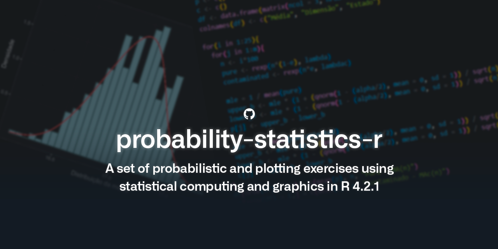

# probability-statistics-r

IST Probability and Statistics course's computational project (LEIC-A 2021/2022). Made by [José João Ferreira](https://github.com/jjasferreira).

---

## Tools

Every exercise was made using [RStudio](https://github.com/rstudio/rstudio), an integrated development environment (IDE) for the [R programming language](https://www.r-project.org/).

I made the final reports using [Obsidian](https://obsidian.md/).
