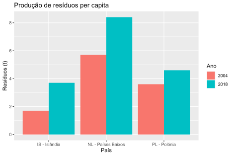

# Exercício 01

Os dados no ficheiro `ResiduosPerCapita.xlsx` correspondem à produção de resíduos per capita em **30** países europeus, nos anos 2004 e 2018.
Com recurso à função `ggplot` represente, num diagrama de barras lado a lado, a produção de resíduos per capita nos países **PL - Polonia**, **IS - Islandia**, e **NL - Paises Baixos**, nos anos 2004 e 2018.

## Resultado

## Comentários

Após uma leitura inicial das linhas e colunas necessárias do ficheiro Excel, renomeei duas colunas por forma a organizar melhor os dados em mãos.
"Alonguei" os dados, passando os anos 2004 e 2018, que inicialmente estavam em colunas separadas, para a mesma coluna, ficando os seus valores correspondentes numa nova coluna.
Finalmente, filtrei os países que interessavam e criei o gráfico desejado. Após confirmação, os resultados estão de acordo com os dados do ficheiro. Como podemos ver, a produção de resíduos per capita aumentou significativamente nos 3 países analisados, entre 2004 e 2018.
