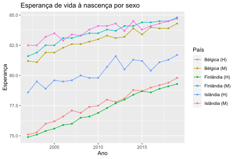

# Exercício 02

Os dados no ficheiro `EsperancaVida.xlsx` correspondem aos valores da esperança de vida à nascença (total e por sexo) em **31** países europeus, entre 1960 e 2020.
Com recurso à função `ggplot` represente, num mesmo gráfico temporal, as séries dos valores da esperança de vida à nascença das mulheres e dos homens, entre 2002 e 2019, nos países **FI - Finlandia**, **BE - Belgica** e **IS - Islandia**.

## Resultado

## Comentários

Inicialmente, li apenas as linhas e colunas necessárias do ficheiro a analisar. De seguida, removi não só as colunas referentes a "Todos", como também as dos países que não são relevantes para o exercício.
Após renomear as colunas do _dataframe_, removi, também, as linhas referentes aos anos entre 1960 e 2001.
Tornei o _dataframe_ largo num mais comprido para facilitar a manipulação dos dados e criei o gráfico temporal, a partir do qual podemos concluir que a esperança média de vida tem vindo a aumentar, na generalidade, nos últimos anos, verificando-se uma vantagem significativa nos indivíduos do sexo feminino.
