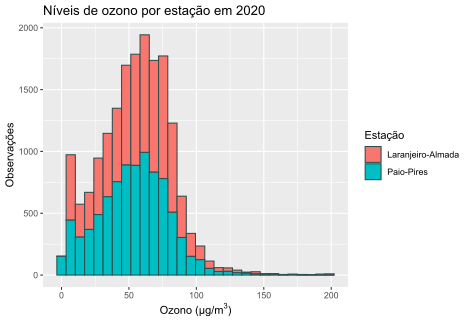

# Exercício 03

Os dados no ficheiro `QualidadeARO3.xlsx` correspondem às observações horárias de níveis de ozono, em microgramas por metro cúbico, recolhidas em **10** estações da rede [QUALAR](https://qualar.apambiente.pt), em 2020.
Com recurso à função `ggplot` represente, num único histograma, os valores dos níveis de ozono registados nas estações de **Paio-Pires** e **Laranjeiro-Almada** em 2020.

## Resultado

## Comentários

A partir da leitura inicial do ficheiro para um _dataframe_ e especificação dos tipos de dados nas colunas, filtrei apenas as colunas referentes às estações que nos interesssam.
"Alonguei" o _dataframe_, de forma a poder ter as estações numa coluna e os valores das observações considerados numa outra que se lhe correspondesse.
Finalmente, criei o histograma que corresponde aos dados do ficheiro.
Após análise, podemos concluir que as observações dos níveis de ozono em ambas as estações se assemelham e concentram em valores entre os 25 e 80 microgramas por metro cúbico.
