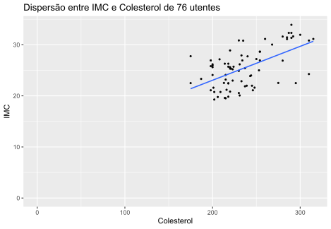

# Exercício 04

O ficheiro `Utentes.xlsx` contém dados relativos a um conjunto de variáveis (Idade, Colesterol, IMC - Índice de Massa Corporal, TAD - Tensão Arterial Diastólica) associadas a **76** utentes de um serviço de saúde.
Construa um gráfico de dispersão entre as variáveis **IMC** e **Colesterol**.

## Resultado

## Comentários

A importação do ficheiro `Utentes.xlsx` para um _dataframe_ foi suficiente para a representação da informação num gráfico de dispersão, sem que fosse necessário tratamento adicional dos dados.
A linha azul representa a aproximação dos pontos dispersos a um declive constante.
A expansão dos limites do gráfico permite que os dados sejam analisados de forma mais intuitiva.
Concluimos que é muito provável que exista uma relação entre as variáveis IMC e Colesterol, sendo que o crescimento de uma conduz, com grande probabilidade, ao crescimento da outra.
