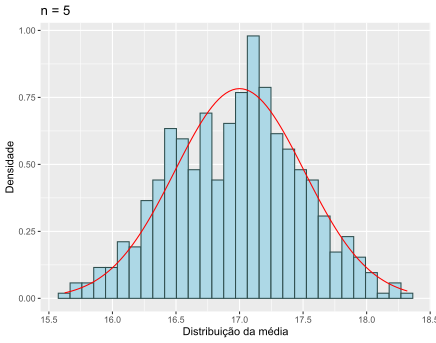
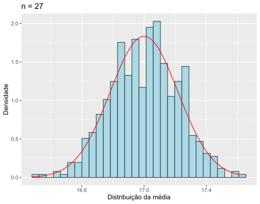

# Exercício 06

Para cada um dos três valores de n = 5, 27 e 97, fixe a semente de geração em 1908 e gere 560 amostras de uma população, X, com distribuição Uniforme contínua no intervalo [15, 19].

Para cada valor de n:

1. Calcule a média de cada uma das amostras obtendo assim valores da distribuição da média X̄ₙ.
2. Faça o histograma de frequência relativa associado aos valores obtidos da distribuição da média X̄ₙ. Sobreponha no gráfico uma curva com a distribuição normal com valor esperado E(X) e variância Var(X)/n.

## Resultado

## Comentários

Como se pode depreender a partir dos gráficos, as distribuições de médias estão relativamente próximas das curvas de distribuição normal adicionadas.
Amostras de grandes dimensões de populações com distribuições uniformes tendem a ter médias mais próximas do valor teórico da média, que é 17, neste caso.
Por outro lado, em amostras de pequena dimensão, as médias tendem a ser mais dispersas e as distribuições das mesmas menos densas, isto é, tendem a não acompanhar tanto a curva.
Assim, a distribuição das médias calculadas de cada uma das 560 amostras de dimensão n com distribuição uniforme contínua no intervalo indicado ([15, 19]) corresponde ao esperado.
