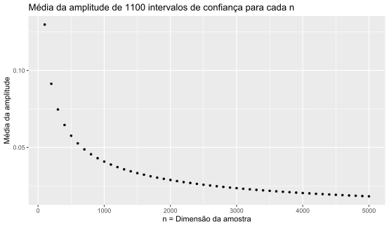

# Exercício 09

#### <🇵🇹>

Usando o R e fixando a semente em 868, gere m = 1100 amostras de dimensão n, onde n ∈ {100, 200, 300, …, 5000}, de uma população X, com distribuição Exponencial de valor esperado 1/λ = 1/0.38, i.e. X ∼ Exp(λ = 0.38).

Para cada uma das amostras geradas, construa um intervalo de confiança aproximado para λ. Considere o nível de confiança 1−α = 0.91.

Para cada valor de n, calcule a Média da Amplitude dos m = 1100 intervalos de confiança obtidos, MA(n).

Construa um gráfico colocando no eixo dos xx a dimensão da amostra, n, e no eixo dos yy o valor de MA(n).

#### <🇬🇧>

Using R and setting the seed to 868, generate m = 1100 samples of dimension n, where n ∈ {100, 200, 300, …, 5000}, from a population X, with exponential distribution of expected value 1/λ = 1 /0.38, i.e. X ∼ Exp(λ = 0.38).

For each of the generated samples, construct an approximate confidence interval for λ. Consider the confidence level 1−α = 0.91.

For each value of n, calculate the Mean Amplitude of the m = 1100 confidence intervals obtained, MA(n).

Construct a graph placing the sample size, n, on the x-axis and the MA(n) value on the y-axis.

## Resultado

## Comentários

#### <🇵🇹>

Os resultados obtidos assemelham-se àquilo que seria de esperar, visto que a curva que relaciona as médias de amplitude com as dimensões respetivas das amostras conduzidas assume uma forma exponencial.

Para valores pequenos de dimensão da amostra, as médias entre todas as amplitudes dos intervalos de confiança são maiores, precisamente porque as amostras são de pequena dimensão.
Quanto maior for a dimensão da amostra, menores são as amplitudes dos intervalos de confiança.

#### <🇬🇧>

The obtained results are similar to what would be expected, since the curve that relates the amplitude averages with the respective dimensions of the conducted samples assumes an exponential form.

For small values of sample size, the averages across all confidence interval amplitudes are larger, precisely because the samples are small.
The larger the sample size, the smaller the amplitudes of the confidence intervals.
