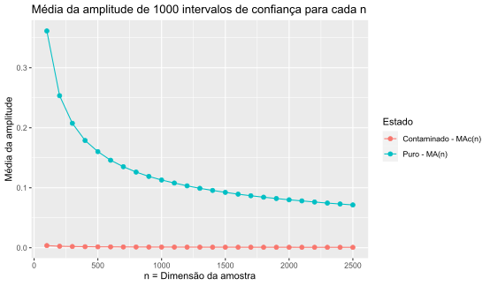

# Exercício 10

Usando o R e fixando a semente em 719, gere m = 1000 amostras de dimensão n, onde n ∈ {100, 200, 300, …, 2500}, de uma população X, com distribuição Exponencial de valor esperado 1/λ = 1/1.02, i.e. X ∼ Exp(λ = 1.02).

Considere as amostras geradas anteriormente e substitua quaisquer ϵ×100% = 20% das observações de cada amostra por outras geradas de uma população que modela a distribuição dos outliers, X𝒸, tal que X𝒸 ∼ Exp(λ𝒸 = 0.01).

Para cada uma das amostras geradas sem contaminação (respetivamente, com contaminação), construa um intervalo de confiança aproximado para o inverso do valor esperado. Considere o nível de confiança (1−α) = 0.92.

Para cada valor de n, calcule a Média da Amplitude dos m = 1000 intervalos de confiança: MA(n), no caso das amostras geradas sem contaminação e MA𝒸(n), no caso de haver contaminação.

Construa um gráfico colocando no eixo dos xx a dimensão da amostra, n, e no eixo dos yy os valores de MA(n) e MA𝒸(n).

## Resultado

## Comentários

A partir do gráfico, conclui-se que os valores da média da amplitude dos intervalos de confiança das amostras contaminadas são inferiores aos das amostras não contaminadas, como seria de esperar, visto que o λ da distribuição exponencial das contaminadas é muito inferior ao das restantes.
